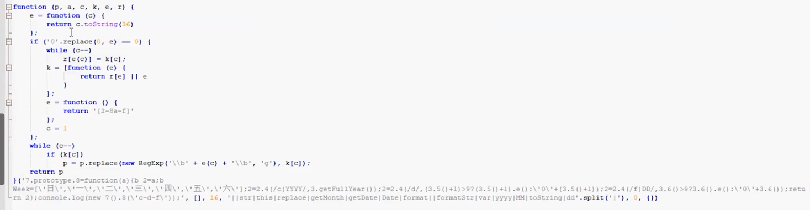
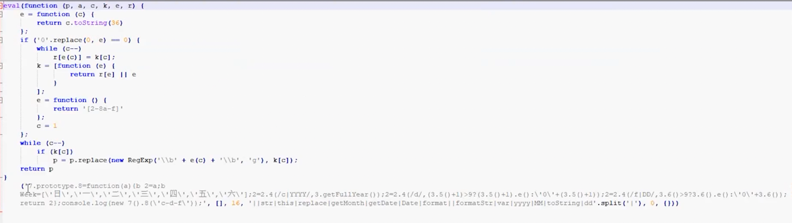
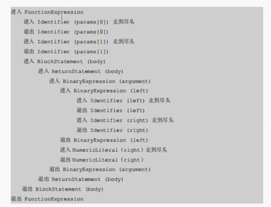

反爬虫AST混淆JavaScript与还原实战

~~~javascript
Date.prototype.format = function (formatStr) {
    var str = formatStr;
    var Week = ["日", "一", "二", "三", "四", "五", "六"];
    str = str.replace(/yyyy|YYYY/, this.getFullYear());
    str = str.replace(
        /MM/,
        this.getMonth() + 1 > 9
            ? (this.getMonth() + 1).toString()
            : "0" + (this.getMonth() + 1)
    );
    str = str.replace(
        /dd|DD/,
        this.getDate() > 9 ? this.getDate().toString() : "0" + this.getDate()
    );
    return str;
};
console.log(new Date().format("yyyy-MM-dd"));
~~~

环境配置

~~~
Node.js
Visual Studio Code

npm i @babel/core
~~~

常量混淆原理

~~~
对象属性的两种访问方式
十六进制字符串
unicode字符串
字符串的ASCII码混淆
字符串常量加密
数值常量加密

~~~

对象属性的两种访问方式

~~~javascript
function People(name) {
  this.name = name;
}
People.prototype.sayHello = function () {
  console.log("Hello");
};
var p = new People("Tom");
console.log(p.name);
p.sayHello();
console.log(p["name"]);
p["sayHello"]();

~~~

十六进制字符串

~~~javascript

// 字符先转 ascii码 再转 16进制

// charAt 用来取出字符串中对应索引的字符
// charCodeAt 用来取出字符串中对应索引的字符的ASCII码
// toString(16) 转成16进制

function hexEnc(code) {
  for (var hexStr = [], i = 0, s; i < code.length; i++) {
    s = code.charCodeAt(i).toString(16);
    hexStr += "\\x" + s;
  }
  return hexStr;
}

~~~

unicode字符串
~~~javascript
function unicodeEnc(str) {
  var value = "";
  for (var i = 0; i < str.length; i++) {
    value +=
      "\\u" + ("0000" + parseInt(str.charCodeAt(i)).toString(16)).substr(-4);
  }
  return value;
}

// 标识符也支持unicode形式表示

// 标识符 以0、o、O组成的名字
// 如：0o000oO
// 注意：标识符不能以数字开头
~~~

字符串的ASCII码混淆

~~~javascript
// String.fromCharCode(120, 98);   //"xb"
// String.fromCharCode 用来将ascii码转为字符

function stringToByte(str) {
  var byteArr = [];
  for (var i = 0; i < str.length; i++) {
    byteArr.push(str.charCodeAt(i));
  }
  return byteArr;
}
console.log(stringToByte("Tom"));

console.log(String.fromCharCode.apply(null, [84, 111, 109]));

~~~

字符串常量加密

有些字符串无法加密

数值常量加密

增加JS逆向者的工作量
~~~
数组混淆
数组乱序
花指令
jsfuck

~~~

数组混淆

~~~javascript
// todo: 字符串可以提取到一个数组里面去，可以让一个函数里面一个数组
~~~

数组乱序

打乱顺序

还原顺序

最终代码

花指令

给代码中添加一些没有意义的代码

二项式转函数的花指令

函数调用表达式处理成花指令

jsfuck

在fuckjs的混淆中，通常使用括号来分组，这是很重要的突破口。当fuckjs整体无法在控制台还原出来的时候，可以根据括号来分段处理。

~~~javascript
// js中7种值表是假值，其余均为真值
false, undefined, null, 0, -0, NaN, ""

+[]
// 数组转数值 0

!+[]
// 数值转逻辑 true

!![]
// true

(!+[]) + (!![])
// +号两边都不是字符串，所以进行数值相加操作，逻辑转数值 2

"".italics()
// '<i></i>'

escape('<i></i>')
// '%3Ci%3E%3C/i%3E'

~~~

处理前

处理后

### JavaScript代码安全防护原理

#### 流程平坦化
#### 逗号表达式混淆

流程平坦化

处理前

处理中

处理后

最终结果

逗号表达式混淆

把多个表达式或语句连接成一个复合语句

逗号连接多个表达式，会返回最后一个（最右边一个）表达式计算之后的结果

~~~javascript
function test() {
  var a = 1;
  var b = a + 2;
  var c = b + 3;
  var d = c + 4;
  var e = d + 5;
  var f = e + 6;
  return f;
}

console.log(test());

var a, b, c;
c = ((b = ((a = 1), a + 2)), b + 3);

var a, b, c;
c = (b = ((a = 1), a + 2)) + 3;

var a, b, c;
c = (((b = ((a = 1), a + 2)), b) + 3, c);

~~~

最终效果

案例

注意
~~~javascript
a = {
    b: function(){return 2;}
}

// 可行
1 + (2,a).b()
1 + (2,a.b)()

// 不行
// (1 + (2,a)).b()
// (1 + (2,a.b))()

~~~

逗号运算符混淆的还原技巧。
在逗号运算符混淆中，通常需要使用括号来分组，那么这就是很重要的突破口。定位到最里面的那个括号，一般就是第一条语句。
然后从里到外，一层一层的根据括号对应关系，来还原语句顺序。

在同一个函数里面 switch 与 逗号 二者选其一

### JavaScript代码安全防护原理

#### eval加密
#### 内存爆破
#### 检测代码是否格式化

eval加密

内存爆破

在代码中加入死代码，正常情况下这段代码不执行，当检测到函数被格式化或者函数被hook，就跳转到这段代码执行，直到内存溢出，浏览器会提示 Out of Memory 程序崩溃。

常见位置：
1、数组顺序还原；
2、解密函数；

### AST的API详解

#### AST入门
#### Babel中的组件
#### Path对象详解
#### scope详解

AST入门

https://astexplorer.net/

JavaScript
@babel/parser

~~~javascript
let obj = {
  name: "lena",
  add: function (a, b) {
    return a + b + 1000;
  },
  mul: function (a, b) {
    return a * b + 1000;
  },
};

~~~

~~~
变量赋值语句
VariableDeclaration

声明关键字
kind

声明具体变量
VariableDeclarator

变量名（标识符）
Identifier

对象字面量
ObjectExpression

对象属性
ObjectProperty

字符串字面量
StringLiteral

匿名函数 
FunctionExpression  // id: null

普通函数
FunctionExpression  // id: Identifier

代码块（两个花括号）
BlockStatement

返回语句
ReturnStatement

二项式（+）
BinaryExpression

~~~

代码基本结构

前提 `npm i @babel/core`

~~~javascript
const fs = require("fs");
const parser = require("@babel/parser");
const traverse = require("@babel/traverse").default;
const t = require("@babel/types");
const generator = require("@babel/generator").default;

const jscode = fs.readFileSync("./input.js", { encoding: "utf-8" });

let ast = parser.parse(jscode);

let code = generator(ast).code;
fs.writeFile("./output.js", code, (err) => {});

// 读取 JS 文件 ==》 解析成 AST ==》 对节点进行一系列的增删改查 ==》 生成 JS 代码 ==》 保存到新文件中

~~~

parser.parse

~~~javascript
let ast = parser.parse(jscode, {sourceType: "module"});

// sourceType 默认是 script
// 当解析的 JS 代码中，含有 import、export 等关键字时，需要指定 sourceType 为 module

~~~

generator

~~~javascript
let code =  generator(ast, {
  retainLines: false,
  comments: false,
  compact: true
}).code;
console.log(code);

// retainLines 是否使用与源代码相同的行号。默认 false。
// comments 是否保留注释。默认 true。
// compact 是否压缩代码。相同作用的选项：minified（压缩最多）、concise（压缩最少）。

// 注意：使用压缩代码时，retainLines 需要改为 false。

// 常用选项：
// retainLines、concise、minified、compact、JsescOption

JsescOption: {
  minimal: true // js代码中如果包含 16进制字符串、unicode字符串 则会直接被还原
}
~~~

traverse

~~~javascript
let visitor = {};
visitor.FunctionExpression = function (path) {
  console.log("lena");
};
traverse(ast, visitor);

// 定义对象同时指定属性
let visitor = {
  FunctionExpression: function (path) {
    console.log("lena");
  },
};
traverse(ast, visitor);

// 利用es6语法（最常用）
let visitor = {
  FunctionExpression(path) {
    console.log("lena");
  },
};
traverse(ast, visitor);

// 节点属性值不是函数而是对象（节点进入的时候，执行函数）
let visitor = {
  FunctionExpression: {
    enter(path) {
      console.log("lena");
    },
  },
};

traverse(ast, visitor);
let visitor = {
  FunctionExpression: {
    enter: function (path) {
      console.log("lena");
    },
  },
};
traverse(ast, visitor);

// 节点属性值不是函数而是对象（节点退出的时候，执行函数）
traverse(ast, visitor);
let visitor = {
  FunctionExpression: {
    exit(path) {
      console.log("lena");
    },
  },
};
traverse(ast, visitor);

// 同一函数应用到多个节点
const visitor = {
  "FunctionExpression|BinaryExpression"(path) {
    console.log("leno");
  },
};
traverse(ast, visitor);

// 多个函数应用到同一个节点
function func1(path) {
  console.log("func1");
}
function func2(path) {
  console.log("func2");
}
const visitor = {
  FunctionExpression: {
    enter: [func1, func2],
  },
};
traverse(ast, visitor);

const updateParamNameVisitor = {
  Identifier(path) {
    if (path.node.name === this.paramName) {
      path.node.name = "x";
    }
  },
};
const visitor = {
  FunctionExpression(path) {
    const paramName = path.node.params[0].name;
    path.traverse(updateParamNameVisitor, {
      paramName,
    });
  },
};
traverse(ast, visitor);

~~~

深度优先遍历

~~~
traverse 是一个深度优先的遍历过程。
因此，如果存在父节点，那么enter的处理时机是先处理父节点，再处理子节点。
而exit的处理时机是先处理子节点，再处理父节点。（考虑代码效率时选用）

traverse默认是在enter时候处理，如果要在exit时候处理，必须在visitor中写明。

~~~

types

该组件主要用来判断节点类型，生成新的节点等。
判断节点类型很简单。
比如：
t.isIdentifier(path.node)
等价于：
path.node.type === "Identifier"

~~~javascript
traverse(ast, {
  enter(path) {
    if (path.node.type === "Identifier" && path.node.name == "n") {
      path.node.name = "x";
    }
  },
});

// 上述代码用来把标识符 n 改为 x，
// 在实际修改中还需要考虑标识符的作用域，在这个案例中，visitor没有做任何过滤，遍历到任何一个节点就调用enter函数，所以要判断类型为Identifier，并且name的值为n，才修改为x。

traverse(ast, {
  enter(path) {
    if (t.isIdentifier(path.node,{name: "n"})) {
      path.node.name = "x";
    }
  },
});

// types组件最主要的功能是：可以方便的生成新的节点

~~~

~~~javascript
const t = require("@babel/types");
const generator = require("@babel/generator").default;

let a = t.identifier("a");
let b = t.identifier("b");
let binExpr2 = t.binaryExpression("+", a, b);
let binExpr3 = t.binaryExpression("*", a, b);
let retSta2 = t.returnStatement(
  t.binaryExpression("+", binExpr2, t.numericLiteral(1000))
);
let retSta3 = t.returnStatement(
  t.binaryExpression("+", binExpr3, t.numericLiteral(1000))
);
let bloSta2 = t.blockStatement([retSta2]);
let bloSta3 = t.blockStatement([retSta3]);
let funcExpr2 = t.functionExpression(null, [a, b], bloSta2);
let funcExpr3 = t.functionExpression(null, [a, b], bloSta3);
let objProp1 = t.objectProperty(t.identifier("num"), t.stringLiteral("lena"));
let objProp2 = t.objectProperty(t.identifier("add"), funcExpr2);
let objProp3 = t.objectProperty(t.identifier("mul"), funcExpr3);
let objExpr = t.objectExpression([objProp1, objProp2, objProp3]);
let varDec = t.variableDeclarator(t.identifier("obj"), objExpr);
let localAst = t.variableDeclaration("let", [varDec]);
let code = generator(localAst).code;
console.log(code);

~~~

~~~javascript
// 字面量
numericLiteral()
stringLiteral()
nullLiteral()
booleanLiteral()
regExpLiteral()

// 不同的字面量需要调用不同的方法去生成
// 当生成比较多的字面量的时候，可以使用valueToNode方法简化生成
valueToNode()

// valueToNode方法可以方便的生成各种类型。
// 除了原始类型 undefined、null、string、number、boolean、RegExp、ReadonlyArray、object

let localAst = t.valueToNode([
  1,
  "2",
  null,
  undefined,
  /\w\s/g,
  { x: "1000", y: 2000 },
]);
let code = generator(localAst).code;
console.log(code);

~~~

构造 json 实现 ast 节点

~~~javascript
const generator = require("@babel/generator").default;

let obj = {};
obj.type = "BinaryExpression";
obj.left = { type: "NumericLiteral", value: 1000 };
obj.operator = "/";
obj.right = { type: "NumericLiteral", value: 2000 };
let code = generator(obj).code;
console.log(code);

~~~

#### Path对象详解

##### Path与Node的区别
##### Path中的方法
##### 父级Path
##### 同级Path

~~~javascript
// 停止遍历节点
path.stop()
path.skip()

const fs = require("fs");
const parser = require("@babel/parser");
const traverse = require("@babel/traverse").default;
const generator = require("@babel/generator").default;

const jscode = fs.readFileSync("./input.js", { encoding: "utf-8" });

let ast = parser.parse(jscode);

const updateParamNameVisitor = {
  Identifier(path) {
    if (path.node.name === this.paramName) {
      path.node.name = "x";
    }
    console.log(path);
    path.stop();
  },
};

const visitor = {
  FunctionExpression(path) {
    const paramName = path.node.params[0].name;
    path.traverse(updateParamNameVisitor, { paramName });
  },
};
traverse(ast, visitor);

let code = generator(ast).code;

fs.writeFile("./output.js", code, (err) => {});

NodePath
  parent // 父级节点
  contexts
  data
  parentPath // 父级path
  container // 同级节点
  node // 当前节点
  listKey
  key
  scope // 当前作用域

~~~

获取子节点/Path

为了得到AST节点的属性值，一般先访问到该节点，然后利用path.node.property方法获取属性

~~~javascript
const visitor = {
  BinaryExpression(path) {
    console.log(path.node.left);
    console.log(path.node.right);
    console.log(path.node.operator);
  },
};

traverse(ast, visitor);

~~~

获取到该属性的Path，就需要使用Path对象的get方法，传递的参数为key（其实就是该属性名的字符串形式）。如果是多级访问，以点连接多个key。

~~~javascript
const visitor = {
  BinaryExpression(path) {
    console.log(path.get("left.name"));
    console.log(path.get("right"));
    console.log(path.get("operator"));
  },
};

traverse(ast, visitor);

~~~

判断Path类型

Path对象的type属性 与 Node中的type属性一致
Path对象提供方法来判断自身类型，判断的是Path下面的type
types组件判断类型，判断的是Path下面的Node下面的type，接收类型是节点

~~~javascript
const visitor = {
  BinaryExpression(path) {
    console.log(path.get("left").isIdentifier());
    console.log(path.get("right").isNumericLiteral({ value: 1000 }));
    path.get("left").assertIdentifier();
  },
};

traverse(ast, visitor);

~~~

节点转代码

~~~javascript
const visitor = {
  FunctionExpression(path) {
    console.log(generator(path.node).code);
    // console.log(path.toString());
    // console.log(path + "");
  },
};

traverse(ast, visitor);

~~~

替换节点属性

~~~javascript
const visitor = {
  BinaryExpression(path) {
    path.node.left = t.identifier("x");
    path.node.right = t.identifier("y");
  },
};

traverse(ast, visitor);

~~~

替换整个节点

replaceWith
节点换节点，一换一

~~~javascript
const visitor = {
  BinaryExpression(path) {
    path.replaceWith(t.valueToNode("lena"));
  },
};

traverse(ast, visitor);

~~~

replaceWithMultiple
节点换节点，多换一

~~~javascript
const visitor = {
  ReturnStatement(path) {
    path.replaceWithMultiple([
      t.expressionStatement(t.stringLiteral("lena")),
      t.expressionStatement(t.numericLiteral(1000)),
      t.returnStatement(),
    ]);
    path.stop();
  },
};

traverse(ast, visitor);

// t.expressionStatement 将参数包裹成表达式

~~~

replaceInline (常用)

该方法接收一个参数。
如果参数不为数组，那么replaceInline等同于replaceWith
如果参数是一个数组，那么replaceInline等同于replaceWithMultiple
当然数组成员必须都是节点

~~~javascript
const visitor = {
  StringLiteral(path) {
    path.replaceInline(t.stringLiteral("jack"));
    path.stop();
  },
  ReturnStatement(path) {
    path.replaceInline([
      t.expressionStatement(t.stringLiteral("lena")),
      t.expressionStatement(t.numericLiteral(1000)),
      t.returnStatement(),
    ]);
    path.stop();
  },
};

traverse(ast, visitor);

// 节点替换时注意：
// 因为替换的新节点（t.returnStatement()）里面包含遍历的节点类型（ReturnStatement）
// 所以需要用到 path.stop() 或 path.skip() 停止遍历当前节点和其子节点。不然会造成死循环，RangeError: Maximum call stack size exceeded

~~~

replaceWithSourceString

该方法用字符串源码替换节点

~~~javascript
const visitor = {
  ReturnStatement(path) {
    let argumentPath = path.get("argument");
    console.log(argumentPath.toString());
    argumentPath.replaceWithSourceString(
      `function(){return ${argumentPath}}()`
    );
    path.stop();
  },
};

traverse(ast, visitor);

~~~

删除节点

~~~javascript
const visitor = {
  EmptyStatement(path) {
    path.remove();
  },
};

traverse(ast, visitor);

// EmptyStatement
// js中语句是以;作为语句结尾的，多个;就算是空语句

~~~

插入节点

节点插入到兄弟节点

在当前节点前插入节点
insertBefore

在当前节点后插入节点
insertAfter

~~~javascript
traverse(ast, {
  ReturnStatement(path) {
    path.insertBefore(t.expressionStatement(t.stringLiteral("Before")));
    path.insertAfter(t.expressionStatement(t.stringLiteral("After")));
  },
});

~~~

父级Path

parentPath 与 parent 的关系
path.parentPath.node 等价于 path.parent

path.findParent()
从一个路径向上遍历语法树，直到满足相应的条件

~~~javascript
traverse(ast, {
  ReturnStatement(path) {
    console.log(path.findParent((p) => p.isObjectExpression()).toString() + "\n");
    // path.findParent(function (p) {
    //   return p.isObjectExpression();
    // });
  },
});

~~~

path.find() (常用)
用法与path.findParent()一致，只不过find方法查找的范围包含当前节点，而findParent不包含

~~~javascript
traverse(ast, {
  ObjectExpression(path) {
    console.log(path.find((p) => p.isObjectExpression()).toString());
  },
});

~~~

path.getFunctionParent()
找到最近的函数，对path.find()的封装

path.getStatementParent()
找到最近的语句，对path.find()的封装

~~~javascript
traverse(ast, {
  ReturnStatement(path) {
    console.log(path.parentPath.getStatementParent() + "\n");
  },
});

// 注意：该方法从当前节点开始找起，因此，如果想要找到return语句的父语句，就需要从parentPath中去调用

~~~

父级Path的其他方法
替换父节点 path.parentPath.replaceWith(Node);
删除父节点 path.parentPath.remove();

同级Path

容器
节点下面某个属性值是数组，也可以是对象(对象listKey是undefined)
对同级Path的操作或容器的操作就是指container是数组的情况

同级Path中重要的属性
    container  
    listKey     
    key          
    (scope)

[ReturnStatement] body 0
[ObjectProperty, ObjectProperty, ObjectProperty] properties 0
[FunctionExpression] undefined body

~~~javascript
traverse(ast,{
  ReturnStatement(path){
    console.log(path);
  }
});

traverse(ast,{
  ObjectProperty(path){
    console.log(path);
  }
});

traverse(ast,{
  ObjectExpression(path){
    console.log(path);
  }
});

~~~

一般container为数组的时候就有同级节点，以下内容只考虑container为数组的情况，因为只有这种情况才有意义

~~~javascript
traverse(ast, {
  ReturnStatement(path) {
    console.log(path.inList);
    console.log(path.container);
    console.log(path.listKey);
    console.log(path.key);
    console.log(path.getSibling(path.key).toString());
    path.stop();
  },
});

/*
true
[
  Node {
    type: 'ReturnStatement',
    start: 63,
    end: 83,
    loc: SourceLocation {
      start: [Position],
      end: [Position],
      filename: undefined,
      identifierName: undefined
    },
    argument: Node {
      type: 'BinaryExpression',
      start: 70,
      end: 82,
      loc: [SourceLocation],
      left: [Node],
      operator: '+',
      right: [Node]
    }
  }
]
body
0
return a + b + 1000;
 */
~~~

path.inList
判断是否有同级节点。
注意：当container为数组，但是只有一个成员时，也会返回true

path.container、path.listKey、path.key
path.container 获取容器（包含所有同级节点的数组）
path.listKey 获取容器名
path.key 获取当前节点在容器中的索引

path.getSibling(index)
用于获取同级Path，其中参数index即容器数组中的索引。
index可以通过path.key来获取。
可以对path.key进行加减操作，来定位到不同的同级Path

unshiftContainer 与 pushContainer

~~~javascript
traverse(ast, {
  ReturnStatement(path) {
    path.parentPath.parentPath.unshiftContainer("params", [
      t.identifier("Before1"),
      t.identifier("Before2"),
    ]);
    console.log(
      path.parentPath.pushContainer(
        path.listKey,
        t.expressionStatement(t.stringLiteral("After"))
      )
    );
  },
});

~~~

#### scope详解

##### 获取标识符作用域
##### 获取标识符的绑定
##### referencePaths与constantViolations
##### 遍历作用域
##### 标识符重命名
##### scope的其他方法

~~~javascript
const a = 1000;
let b = 2000;
let obj = {
  name: "jack",
  add: function (a) {
    a = 400;
    b = 300;
    let e = 700;
    function demo() {
      let d = 600;
    }
    demo();
    return a + a + b + 1000 + obj.name;
  },
};
obj.add(100);

~~~

获取标识符作用域

scope.block 获取标识符作用域，返回Node对象
使用方法分为两种情况，变量和函数

~~~javascript
traverse(ast, {
  Identifier(path) {
    if (path.node.name == "e") {
      console.log(generator(path.scope.block).code);
    }
  },
});

traverse(ast, {
  FunctionDeclaration(path) {
    console.log(generator(path.scope.block).code);
  },
});

// 函数作用域需要获取父级作用域才是正确的
traverse(ast, {
  FunctionDeclaration(path) {
    console.log(generator(path.scope.parent.block).code);
  },
});

~~~

获取标识符的绑定

如果传入的标识符不存在，或者当前节点引用不到，那么getBinding方法会返回undefined

Binding{
    identifier a标识符的Node对象
    scope
    path a标识符的Path对象
    kind 表明了这是一个参数，但是它并不代表就是当前demo函数的参数
    constantViolations 变量被赋值的地方
    constant 是否常量
    referencePaths 变量被引用的地方 当前标识符是否引用时，数组中有被引用的Path
    referenced 当前标识符是否被引用（只算读取的操作，赋值不算）
    references 当前标识符被引用的次数
}

~~~javascript
traverse(ast, {
  FunctionDeclaration(path) {
    let binding = path.scope.getBinding("a");
    console.log(binding);
  },
});

traverse(ast, {
  FunctionDeclaration(path) {
    let bindingA = path.scope.getBinding("a");
    let bindingDemo = path.scope.getBinding("demo");
    console.log(bindingA.referenced);
    console.log(bindingA.references);
    console.log(generator(bindingA.scope.block).code);
    coonsole.log(generator(bindingDemo.scope.block).code);
  },
});

// 注意：
// 函数情况下获取作用域
// path.scope.getBinding("a").scope.block 
// 这种情况下的不需要获取父级的作用域
// path.scope.parent.block

~~~

scope.getOwnBinding()
用于获取当前节点自己的绑定，也就是不包含父级作用域中定义的标识符的绑定。但是该函数会得到自函数中定义的标识符的绑定

~~~javascript
function TestOwnBinding(path) {
  path.traverse({
    Identifier(p) {
      let name = p.node.name;
      console.log(name, !!p.scope.getOwnBinding(name));
    },
  });
}

traverse(ast, {
  FunctionExpression(path) {
    TestOwnBinding(path);
  },
});

// 注意：
// 内部定义函数 !!p.scope.getOwnBinding(name) 返回false
// 内部定义函数内变量 !!p.scope.getOwnBinding(name) 返回true
// 

~~~

只获取当前函数定义的变量，而不涉及子函数定义的变量

~~~javascript
function TestOwnBinding(path) {
  path.traverse({
    Identifier(p) {
      let name = p.node.name;
      let binding = p.scope.getBinding(name);
      binding &&
        console.log(
          name,
          generator(binding.scope.block).code === path.toString()
        );
    },
  });
}

traverse(ast, {
  FunctionExpression(path) {
    TestOwnBinding(path);
  },
});

~~~

遍历作用域

scope.traverse 用来遍历作用域中的节点
可以用Path对象中的scope
也可以用Binding中的scope（推荐）

~~~javascript
traverse(ast, {
  FunctionDeclaration(path) {
    let binding = path.scope.getBinding("a");
    binding.scope.traverse(binding.scope.block, {
      AssignmentExpression(p) {
        if (p.node.left.name == "a") {
          p.node.right = t.numericLiteral(500);
        }
      },
    });
  },
});

~~~

标识符重命名

scope.rename方法将标识符进行重命名，这个方法会同时修改所有引用该标识符的地方

path.scope.rename (缺点：会要求traverse遍历的节点必须是Identifier)
path.scope.getBinding("a").scope.rename （推荐，灵活：没有遍历节点的类型要求）

~~~javascript
traverse(ast, {
  FunctionExpression(path) {
    let binding = path.scope.getBinding("b");
    binding.scope.rename("b", "x");
  },
});

~~~

如果硬性指定一个名字的话，有可能会与现有标识符冲突。
这时候可以使用scope.generateUidIdentifier方法生成一个标识符，生成的标识符不会与任何本地定义的标识符冲突。

~~~javascript
traverse(ast, {
  FunctionExpression(path) {
    console.log(path.scope.generateUidIdentifier("uid"));
    console.log(path.scope.generateUidIdentifier("uid"));
    // { type: 'Identifier', name: '_uid' }
    // { type: 'Identifier', name: '_uid2' }
  },
});

~~~

用这两个方法，可以实现一个简单的标识符混淆方案

~~~javascript
traverse(ast, {
  Identifier(path) {
    path.scope.rename(
      path.node.name,
      path.scope.generateUidIdentifier("_0x2ba6ea").name
    );
  },
});

~~~

scope的其他方法

scope.hasBinding('a')
查询是否有标识符a的绑定，返回true或false。
其实可以用scope.getBinding('a')代替。
scope.getBinding('a')返回undefined的时候，等同于scope.hasBinding('a')返回false

scope.hasOwnBinding('a')
查询是否有自己的绑定，返回true或false。
OwnBinding只有一个d。
注意：
函数名demo虽然也是标识符，但不属于demo函数的OwnBinding范畴，是属于它的父级作用域的。

~~~javascript
traverse(ast, {
  FunctionDeclaration(path) {
    console.log(path.scope.parent.hasOwnBinding("demo"));
  },
});

~~~

同样地，可以使用scope.getOwnBinding('a')代替它。
scope.getOwnBinding('a')返回undefined的时候，
等同于scope.hasOwnBinding('a')返回false
其实源码中scope.hasOwnBinding('a')也是通过scope.getOwnBinding('a')来实现。

scope.getAllBindings()
获取当前节点的所有绑定，会返回一个对象。
该对象以标识符名为属性名，对应的Binding为属性值。

将当前遍历节点中所有能够引用到的标识符表示出来，标识符名字作为属性名，绑定对象作为属性值

~~~javascript
traverse(ast, {
  FunctionDeclaration(path) {
    const obj = path.scope.getAllBindings();
    for (k in obj) {
      console.log(generator(obj[k].scope.block).code + "\n\n");
    }
  },
});

~~~

scope.hasReference('a')
查询当前节点中是否有a标识符的引用，返回true或false

~~~javascript
traverse(ast, {
  FunctionDeclaration(path) {
    console.log(generator(path.scope.block).code);
    console.log(path.scope.getBinding("a").referenced);
    console.log(path.scope.hasReference("a"));
  },
});

~~~

scope.getBindingIdentifier('a')
获取当前节点中绑定的a标识符，返回的是Identifier的Node对象。
同样地，这个方法也有Own版本，scope.getOwnBindingIdentifier('a')

主要用：
scope.getOwnBinding() 
referencePaths
constantViolations

AST自动化JavaScript防护方案

混淆前的代码处理
常量与标识符的混淆
代码块的混淆
完整的代码与处理后的效果
代码执行逻辑的混淆

改变对象属性的访问方式

