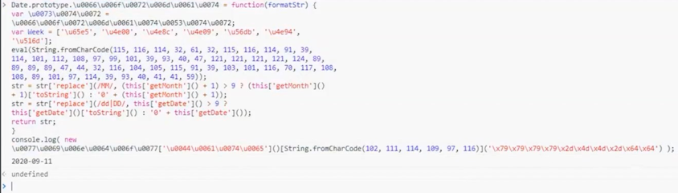

反爬虫AST混淆JavaScript与还原实战

~~~javascript
Date.prototype.format = function (formatStr) {
    var str = formatStr;
    var Week = ["日", "一", "二", "三", "四", "五", "六"];
    str = str.replace(/yyyy|YYYY/, this.getFullYear());
    str = str.replace(
        /MM/,
        this.getMonth() + 1 > 9
            ? (this.getMonth() + 1).toString()
            : "0" + (this.getMonth() + 1)
    );
    str = str.replace(
        /dd|DD/,
        this.getDate() > 9 ? this.getDate().toString() : "0" + this.getDate()
    );
    return str;
};
console.log(new Date().format("yyyy-MM-dd"));
~~~

环境配置

~~~
Node.js
Visual Studio Code

npm i @babel/core
~~~

常量混淆原理

~~~
对象属性的两种访问方式
十六进制字符串
unicode字符串
字符串的ASCII码混淆
字符串常量加密
数值常量加密

~~~

对象属性的两种访问方式

~~~javascript
function People(name) {
  this.name = name;
}
People.prototype.sayHello = function () {
  console.log("Hello");
};
var p = new People("Tom");
console.log(p.name);
p.sayHello();
console.log(p["name"]);
p["sayHello"]();

~~~

十六进制字符串

~~~javascript

// 字符先转 ascii码 再转 16进制

// charAt 用来取出字符串中对应索引的字符
// charCodeAt 用来取出字符串中对应索引的字符的ASCII码
// toString(16) 转成16进制

function hexEnc(code) {
  for (var hexStr = [], i = 0, s; i < code.length; i++) {
    s = code.charCodeAt(i).toString(16);
    hexStr += "\\x" + s;
  }
  return hexStr;
}

~~~

unicode字符串
~~~javascript
function unicodeEnc(str) {
  var value = "";
  for (var i = 0; i < str.length; i++) {
    value +=
      "\\u" + ("0000" + parseInt(str.charCodeAt(i)).toString(16)).substr(-4);
  }
  return value;
}

// 标识符也支持unicode形式表示

// 标识符 以0、o、O组成的名字
// 如：0o000oO
// 注意：标识符不能以数字开头
~~~

字符串的ASCII码混淆

~~~javascript
// String.fromCharCode(120, 98);   //"xb"
// String.fromCharCode 用来将ascii码转为字符

function stringToByte(str) {
  var byteArr = [];
  for (var i = 0; i < str.length; i++) {
    byteArr.push(str.charCodeAt(i));
  }
  return byteArr;
}
console.log(stringToByte("Tom"));

console.log(String.fromCharCode.apply(null, [84, 111, 109]));

~~~

字符串常量加密

有些字符串无法加密

数值常量加密

增加JS逆向者的工作量
~~~
数组混淆
数组乱序
花指令
jsfuck

~~~

数组混淆

~~~javascript
// todo: 字符串可以提取到一个数组里面去，可以让一个函数里面一个数组
~~~

数组乱序

打乱顺序

还原顺序

最终代码

花指令

给代码中添加一些没有意义的代码

二项式转函数的花指令

函数调用表达式处理成花指令

jsfuck

在fuckjs的混淆中，通常使用括号来分组，这是很重要的突破口。当fuckjs整体无法在控制台还原出来的时候，可以根据括号来分段处理。

~~~javascript
// js中7种值表是假值，其余均为真值
false, undefined, null, 0, -0, NaN, ""

+[]
// 数组转数值 0

!+[]
// 数值转逻辑 true

!![]
// true

(!+[]) + (!![])
// +号两边都不是字符串，所以进行数值相加操作，逻辑转数值 2

"".italics()
// '<i></i>'

escape('<i></i>')
// '%3Ci%3E%3C/i%3E'

~~~

处理前

处理后

JavaScript代码安全防护原理

1. 流程平坦化
2. 逗号表达式混淆

流程平坦化

处理前

处理中

处理后

最终结果

逗号表达式混淆

把多个表达式或语句连接成一个复合语句

逗号连接多个表达式，会返回最后一个（最右边一个）表达式计算之后的结果

~~~javascript
function test() {
  var a = 1;
  var b = a + 2;
  var c = b + 3;
  var d = c + 4;
  var e = d + 5;
  var f = e + 6;
  return f;
}

console.log(test());

var a, b, c;
c = ((b = ((a = 1), a + 2)), b + 3);

var a, b, c;
c = (b = ((a = 1), a + 2)) + 3;

var a, b, c;
c = (((b = ((a = 1), a + 2)), b) + 3, c);

~~~

最终效果

案例

